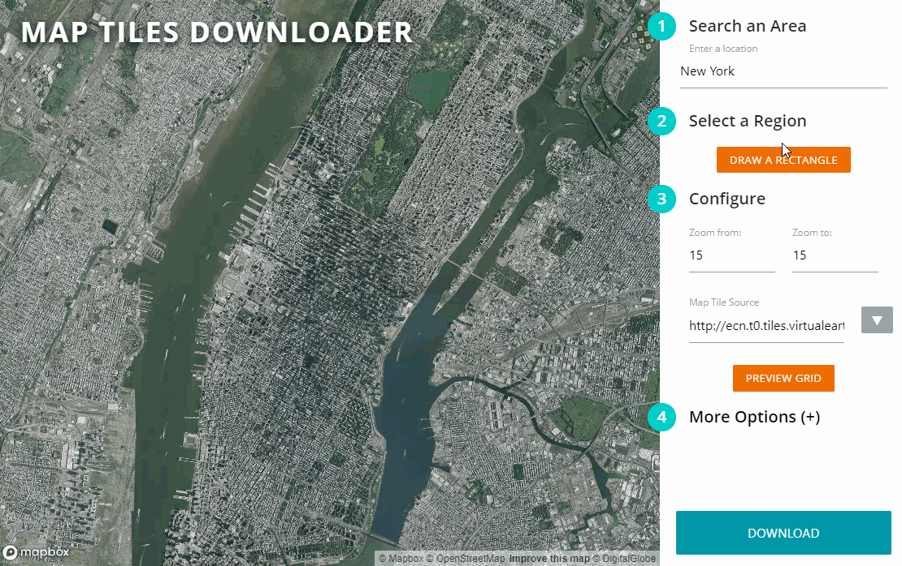

# Map Tiles Downloader

**A super easy to use GUI for downloading map tiles**

<p align="center">
  
</p>

## So what does it do?

This tiny python based script allows you to download map tiles from Google, Bing, Open Street Maps, ESRI, NASA, and other providers. This script comes with an easy to use web based map UI for selecting the area and previewing tiles.

**Just run the script via command line**

```sh
python server.py
```

If your web browser doesn't open a map afterwards, navigate to `UI\index.htm` and open it manually. The output tiles will be in the `output\{timestamp}\` directory by default.

## Requirements

Needs **Python 3.5** and a modern web browser. Other Python versions could work but aren't yet tested.

## Purpose

I design map related things as a hobby, and often I have to work with offline maps that require tiles to be stored on my local system. Downloading tiles is a bit of a headache, and the current solutions have user experience issues. So I built this tiny script in a couple of hours to speed up my work.

## Features

- Super easy to use map UI to select region and options
- Multi-threading to download tiles in parallel
- Cross platform, use any OS as long as it has Python and a browser
- Select multiple zoom levels in one go
- Ability to ignore tiles already downloaded
- Specify any custom file name format
- Supports ANY tile provider as long as the url has `x`, `y`, `z`, or `quad` in it
- Built using MapBox :heart:

## Important Disclaimer

Downloading map tiles is subject to the terms and conditions of the tile provider. Some providers such as Google Maps have restrictions in place to avoid abuse, therefore before downloading any tiles make sure you understand their TOCs. I recommend not using Google, Bing, and ESRI tiles in any commercial application without their consent.

## Stay In Touch

For latest releases and announcements, check out my site: [aliashraf.net](http://aliashraf.net)

## License

This software is released under the [MIT License](LICENSE). Please read LICENSE for information on the
software availability and distribution.

Copyright (c) 2018 [Ali Ashraf](http://aliashraf.net)