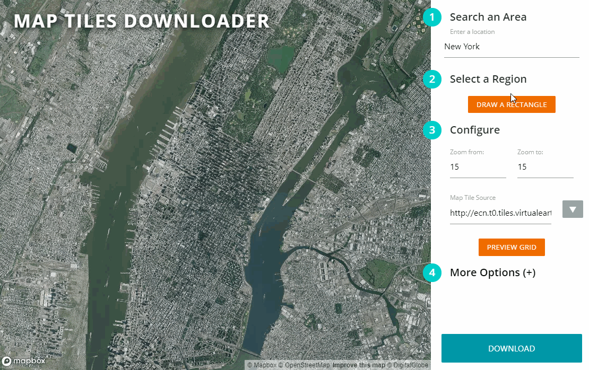

# Map Tiles Downloader

**A super easy to use GUI for downloading map tiles**

<p align="center">
  
</p>

## So what does it do?

This tiny python based script allows you to download map tiles from Google, Bing, Open Street Maps, ESRI, and other providers. This script comes with an easy to use web based map UI for selecting the area and previewing tiles.

**Just run the script via command line**

```sh
cd src
python server.py
```

Then open up your web browser and navigate to `http://localhost:8080`. The output map tiles will be in the `src/output/{timestamp}/` directory by default.

## Requirements

Needs **Python 3.13+** and a modern web browser. Install dependencies with:

```sh
pip install -r requirements.txt
```

| Package | Purpose |
|---------|---------|
| [Pillow](https://pypi.org/project/Pillow/) | Tile scaling (2x/Hi-Res output) |
| [pyvips](https://pypi.org/project/pyvips/) | Tile stitching — memory-efficient image assembly |

On Windows, `pyvips[binary]` bundles the required libvips DLLs automatically. On Linux/macOS, install libvips via your package manager (`apt install libvips` / `brew install vips`) before running pip.

> **Note:** The `cgi` module was removed in Python 3.13. This repo has been updated to use the `email` module as a replacement. Python versions older than 3.13 are not tested with the current code.

## Via Docker

Docker is a pretty simple way to install and contain applications. [Install Docker on your system](https://www.docker.com/products/docker-desktop), and paste this on your command line:

```sh
docker run -v $PWD/output:/app/output/ -p 8080:8080 -it aliashraf/map-tiles-downloader
```

Now open the browser and head over to `http://localhost:8080`. The downloaded maps will be stored in the `output` directory.

## Purpose

I design map related things as a hobby, and often I have to work with offline maps that require tiles to be stored on my local system. Downloading tiles is a bit of a headache, and the current solutions have user experience issues. So I built this tiny script in a couple of hours to speed up my work.

## Features

- Super easy to use map UI to select region and options
- Multi-threading to download tiles in parallel
- Cross platform, use any OS as long as it has Python and a browser
- Dockerfile available for easy setup
- Supports 2x/Hi-Res/Retina/512x512 tiles by merging multiple tiles
- Supports downloading to file as well as mbtile format
- Select multiple zoom levels in one go
- Ability to ignore tiles already downloaded
- Specify any custom file name format
- Supports ANY tile provider as long as the url has `x`, `y`, `z`, or `quad` in it
- Base map uses OpenStreetMap (no API key required)
- **Built-in tile stitcher** — assembles all downloaded tiles into a single GeoTIFF with one click, using [libvips](https://www.libvips.org/) for memory-efficient processing of very large images

## Tile Sources

The following providers are available from the dropdown and have been verified working:

| Provider | Type | Notes |
|----------|------|-------|
| Bing Maps | Road | |
| Bing Maps Satellite | Satellite | |
| Bing Maps Hybrid | Satellite + labels | |
| Google Maps | Road | Unofficial endpoint, may be rate-limited |
| Google Maps Satellite | Satellite | Unofficial endpoint, may be rate-limited |
| Google Maps Hybrid | Satellite + labels | Unofficial endpoint, may be rate-limited |
| Google Maps Terrain | Terrain | Unofficial endpoint, may be rate-limited |
| Open Street Maps | Road | |
| Open Cycle Maps | Cycling | |
| ESRI World Imagery | Satellite | Best quality, up to zoom 19-20, free, no key required |
| Carto Light | Road (minimal) | |

**For the highest quality satellite imagery**, use **ESRI World Imagery** at zoom level 18 or 19.

## Zoom Levels

Zoom level controls the detail and tile count. Each level up has 4× more tiles than the previous.

| Zoom | Detail level |
|------|-------------|
| 1–5 | Country / continent |
| 10–12 | City |
| 15–16 | Street (default) |
| 18–19 | Building / maximum detail |

Set **Zoom from** and **Zoom to** to the same value to download only that level. Set a range to download multiple levels at once (useful for maps that need to work at different scales).

## Output

Tiles are saved to `src/output/{timestamp}/` by default, in `{z}/{x}/{y}.png` folder structure. Both the output directory and file name format can be customised under **More Options** in the UI.

## Stitching Tiles into a Single Image

The downloader includes a built-in stitcher powered by [libvips](https://www.libvips.org/). Unlike Photoshop or Pillow, libvips processes images in strips rather than loading everything into RAM, so it handles multi-gigapixel outputs without running out of memory.

**To use:**
1. Check **Stitch tiles into image after download** (visible above the Download button — only enabled for Directory output type)
2. Start the download as normal
3. Once all tiles have downloaded, stitching begins automatically
4. Progress is shown in the log panel; the button shows **STITCHING...** while it runs
5. Output is saved alongside the tile folders as `stitched_z{zoom}.tif` — one file per zoom level

The output is a tiled, deflate-compressed TIFF compatible with GIS tools (QGIS, GDAL, ArcGIS) and image editors. For zoom ranges, a separate TIFF is produced for each zoom level.

> **Note:** Stitching is only available when **Output type** is set to **Directory** (the default). MBTiles and Repo formats store tiles internally and don't produce individual image files to stitch from.

## Important Disclaimer

Downloading map tiles is subject to the terms and conditions of the tile provider. Some providers such as Google Maps have restrictions in place to avoid abuse, therefore before downloading any tiles make sure you understand their TOCs. I recommend not using Google, Bing, and ESRI tiles in any commercial application without their consent.

## Stay In Touch

For latest releases and announcements, check out my site: [aliashraf.net](http://aliashraf.net)

## License

This software is released under the [MIT License](LICENSE). Please read LICENSE for information on the
software availability and distribution.

Copyright (c) 2020 [Ali Ashraf](http://aliashraf.net)